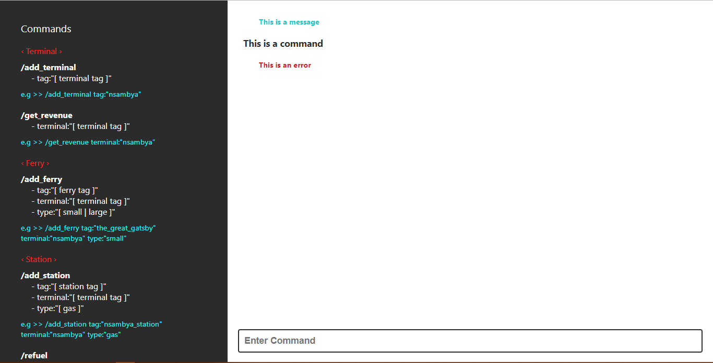
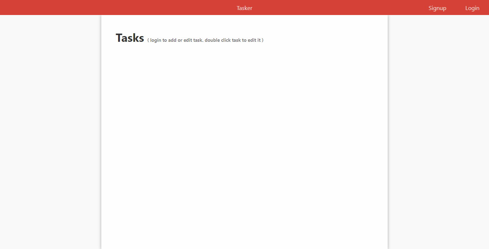
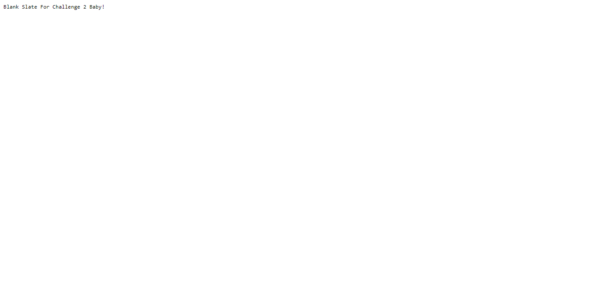

# FENIX CHALLENGES 1 AND 2

Hello and welcome to my implementation of the fenixinl challenges. This repository contains 4 projects ( 2 web apps and 2 backends ) with the webapps developed using react and the backends developed using python.

## 1. Pre-requisites

In order to run the projects in the repo, your machine should have the following programs 

- Git ( https://git-scm.com/ )
- Docker ( https://www.docker.com/ )
- Docker Compose ( https://docs.docker.com/compose/ )

NB : Ports 5001, 5002, 3001, 3002, 27017 should free

## 2. Installation & Running

In order to install and run the projects in the repo;

1. Install the required programs in the event you do not have them.

2. Clone this repo to a location on your machine
```bash
    $ git clone https://github.com/ghostfreak3000/fenixintl-fullstack-challenge.git
```
3. At the root of the project Directory run the docker compose command to build and bootup the services
```bash
    # path/to/root/of/project
    $ docker-compose up -d
```
If running this command for the first time, docker will pull and build all containers with the necessary dependencies ( this will take sometime depending on the speed and reliability of your internet connection).

4. After the docker-compose command finishes executing, 5 services will be available namely

    - ch1_ui : The UI for challenge 1 running on port 3001
    - ch1_api : The API for challenge 1 running on port 5001
    - ch2_ui : The UI for challenge 2 running on port 3002
    - ch2_api : The API for challenge 2 running on port 5002
    - mongodb : The mongo db database used by both ch1_api and ch2_api for simplicity sake running on port 27017

NB: On Linux, since the services will essentially be on the same network as your main account, they will be accessible on 127.0.0.1.. There is a likely chance that if you already have a running instance of mongodb, the mongodb service will fail to start.

I have developed this project on the Windows platform using Docker Toolbox, so on my machine the services were deployed to a VM accessible on an ip address. you will have to determine on which ip address the services are accessible on

## 3 Success scenario

Upon successful installation and running, 

### 3.1 Loading the ch1_ui should return the following screen



### 3.2 Loading the ch1_api root route should return the following response


### 3.3 Loading the ch2_ui should return the following screen



### 3.4 Loading the ch2_api root route should return the following response




## 4 Closing Remarks

Please do not hesitate to get back to me incase of any inquiries.